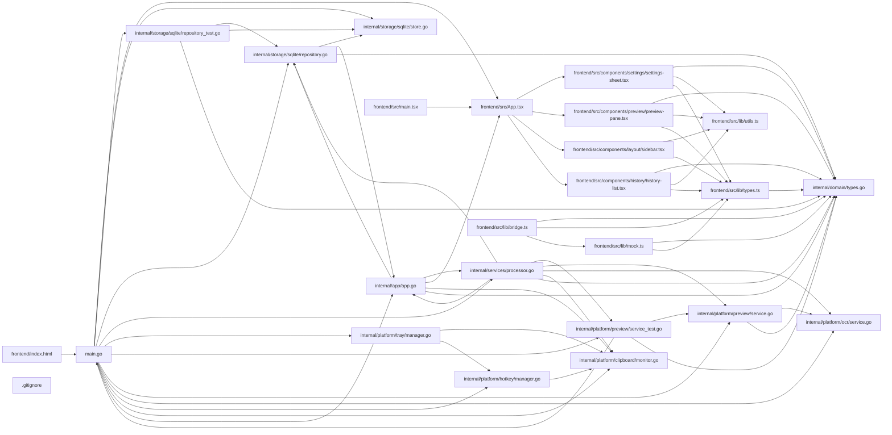

## ARCHITECTURE

A software project composed of the following subsystems:

- **frontend/**: Primary subsystem containing 35 files
- **internal/**: Primary subsystem containing 13 files
- **docs/**: Primary subsystem containing 3 files
- **Root**: Contains scripts and execution points

## ENTRY_POINTS

### `main.go`

```go
package main

import (
	"context"
	"embed"
	"log/slog"
	"os"

	"github.com/granthio/glyph/internal/app"
	"github.com/granthio/glyph/internal/config"
	"github.com/granthio/glyph/internal/platform/clipboard"
	"github.com/granthio/glyph/internal/platform/hotkey"
	"github.com/granthio/glyph/internal/platform/ocr"
	"github.com/granthio/glyph/internal/platform/preview"
	"github.com/granthio/glyph/internal/platform/tray"
	"github.com/granthio/glyph/internal/services"
	sqlitestore "github.com/granthio/glyph/internal/storage/sqlite"
	"github.com/wailsapp/wails/v2"
	"github.com/wailsapp/wails/v2/pkg/options"
	"github.com/wailsapp/wails/v2/pkg/options/assetserver"
)

//go:embed all:frontend/dist
var assets embed.FS

func main() {
	logger := slog.New(slog.NewTextHandler(os.Stdout, &slog.HandlerOptions{Level: slog.LevelInfo}))

	cfg, err := config.Load()
	if err != nil {
		logger.Error("load config", "error", err)
		os.Exit(1)
	}

	store, err := sqlitestore.Open(cfg.Storage.DatabasePath)
	if err != nil {
		logger.Error("open database", "error", err)
		os.Exit(1)
	}
	defer store.Close()

	repo := sqlitestore.NewRepository(store.DB)
	previewer := preview.NewService()
	ocrService := ocr.NewService(logger, cfg)
	processor := services.NewClipboardProcessor(logger, cfg, repo, previewer, ocrService)
	monitor := clipboard.NewMonitor(logger)
	application := app.New(logger, cfg, repo, monitor, processor, hotkey.NewManager(logger), tray.NewManager(logger))

	err = wails.Run(&options.App{
		Title:            "Glyph",
		Width:            1360,
		Height:           860,
		MinWidth:         1100,
		MinHeight:        700,
		Frameless:        true,
		DisableResize:    false,
		WindowStartState: options.Normal,
		BackgroundColour: &options.RGBA{R: 12, G: 16, B: 18, A: 0},
		OnStartup: func(ctx context.Context) {
			application.Startup(ctx)
		},
		OnShutdown: func(ctx context.Context) {
			application.Shutdown(ctx)
		},
		AssetServer: &assetserver.Options{Assets: assets},
		Bind:        []any{application},
	})
	if err != nil {
		logger.Error("run app", "error", err)
		os.Exit(1)
	}
}

```

## SYMBOL_INDEX

**`internal/domain/types.go`**
- class `ClipboardItemType`
- class `PreviewKind`
- class `Preview`
- class `ClipboardItem`
- class `Tag`
- class `Collection`
- class `SearchQuery`
- class `Settings`
- class `BootstrapPayload`

**`internal/config/config.go`**
- class `Config`
- `Load()`
- `defaultRootDir()`
- `defaultConfig()`
- `Save()`
- `EnsureStoragePath()`
- `DomainSettings()`
- `ApplySettings()`
- `ensureDirs()`

**`internal/platform/clipboard/monitor.go`**
- class `Capture`
- class `Handler`
- class `Monitor`
- `NewMonitor()`
- `Start()`

**`main.go`**
- `main()`

**`internal/storage/sqlite/store.go`**
- class `Store`
- `Open()`
- `Close()`
- `migrate()`

**`frontend/src/App.tsx`**
- `App()`

**`internal/platform/ocr/service.go`**
- class `Service`
- `NewService()`
- `ExtractText()`

**`internal/platform/preview/service.go`**
- class `Service`
- `NewService()`
- `FromItem()`
- `DetectType()`
- `summarize()`
- `prettyJSON()`

**`internal/platform/hotkey/manager.go`**
- class `Manager`
- `NewManager()`
- `Start()`

**`internal/platform/preview/service_test.go`**
- `TestDetectType()`
- `TestPrettyJSON()`

**`internal/services/processor.go`**
- class `Repository`
- class `ClipboardProcessor`
- `NewClipboardProcessor()`
- `Process()`
- `deriveTitle()`
- `newID()`

**`frontend/src/lib/utils.ts`**
- `cn()`

**`internal/platform/tray/manager.go`**
- class `Manager`
- `NewManager()`
- `Start()`

**`internal/storage/sqlite/repository_test.go`**
- `TestRepositoryUpsertAndSearch()`

**`frontend/src/components/history/history-list.tsx`**
- `typeIcon()`
- `typeBadgeClass()`
- `formatRelative()`
- `HistoryRow()`
- `HistoryList()`

**`frontend/src/components/layout/sidebar.tsx`**
- `Sidebar()`

**`frontend/src/components/preview/preview-pane.tsx`**
- `actionsFor()`
- `PreviewPane()`

**`frontend/src/components/settings/settings-sheet.tsx`**
- `SettingRow()`
- `Divider()`
- `SettingsSheet()`

**`internal/app/app.go`**
- class `Repository`
- class `ClipboardMonitor`
- class `HotkeyManager`
- class `TrayManager`
- class `Processor`
- class `App`
- `New()`
- `Startup()`
- `Shutdown()`
- `Bootstrap()`
- `SearchHistory()`
- `GetRecentItems()`
- `GetItem()`
- `ToggleFavorite()`
- `DeleteItem()`
- `ClearHistory()`
- `GetSettings()`
- `UpdateSettings()`
- `CreateTag()`
- `AssignTag()`
- `CreateCollection()`
- `AssignCollection()`
- `ExecuteAction()`
- `ShowWindow()`
- `HideWindow()`
- `handleClipboard()`
- `slugID()`

**`internal/storage/sqlite/repository.go`**
- class `Repository`
- `NewRepository()`
- `Bootstrap()`
- `UpsertItem()`
- `ListRecent()`
- `Search()`
- `GetItem()`
- `ToggleFavorite()`
- `DeleteItem()`
- `ClearHistory()`
- `ListTags()`
- `CreateTag()`
- `AssignTag()`
- `ListCollections()`
- `CreateCollection()`
- `AssignCollection()`
- `baseSelect()`
- `scanItems()`
- `escapeFTS5()`
- `boolToInt()`

**`frontend/src/lib/bridge.ts`**
- `goApp()`

## IMPORTANT_CALL_PATHS

main.main()
  → monitor.Capture()
## CORE_MODULES

### `internal/domain/types.go`

**Purpose:** Implements types.

**Types:**
- `BootstrapPayload`
- `ClipboardItem`
- `ClipboardItemType`
- `Collection`
- `Preview`
- `PreviewKind`

### `frontend/src/lib/types.ts`

**Purpose:** Implements types.

### `internal/config/config.go`

**Purpose:** Implements config.

**Types:**
- `Config`

**Functions:**
- `func Load() (*Config, error)`
- `func defaultConfig(root string) *Config`
- `func defaultRootDir() (string, error)`
- `func (c *Config) ApplySettings(settings domain.Settings)`
- `func (c *Config) DomainSettings() domain.Settings`
- `func (c *Config) EnsureStoragePath(name string) string`
- `func (c *Config) Save() error`
- `func (c *Config) ensureDirs() error`

### `internal/platform/clipboard/monitor.go`

**Purpose:** Implements monitor.

**Types:**
- `Capture`
- `Handler` (bases: `context.Context, Capture`)
- `Monitor`

**Functions:**
- `func NewMonitor(logger *slog.Logger) *Monitor`
- `func (m *Monitor) Start(ctx context.Context, handler Handler) error`

### `internal/storage/sqlite/store.go`

**Purpose:** Implements store.

**Types:**
- `Store`

**Functions:**
- `func Open(path string) (*Store, error)`
- `func migrate(db *sql.DB) error`
- `func (s *Store) Close() error`

### `frontend/src/App.tsx`

**Purpose:** Implements App.

**Functions:**
- `function App()`

### `internal/platform/ocr/service.go`

**Purpose:** Implements service.

**Types:**
- `Service`

**Functions:**
- `func NewService(logger *slog.Logger, cfg *config.Config) *Service`
- `func (s *Service) ExtractText(ctx context.Context, imagePath string) string`

### `internal/platform/preview/service.go`

**Purpose:** Implements service.

**Types:**
- `Service`

**Functions:**
- `func DetectType(text string, filePath string, hasImage bool) domain.ClipboardItemType`
- `func NewService() *Service`
- `func prettyJSON(value string) string`
- `func summarize(value string, limit int) string`
- `func (s *Service) FromItem(item domain.ClipboardItem) domain.Preview`

## SUPPORTING_MODULES

### `internal/platform/hotkey/manager.go`

```go
Manager struct

func NewManager(logger *slog.Logger) *Manager

func (m *Manager) Start(_ context.Context, _ string, _ func()) error

```

### `internal/platform/preview/service_test.go`

```go
func TestDetectType(t *testing.T)

func TestPrettyJSON(t *testing.T)

```

### `internal/services/processor.go`

```go
Repository interface

ClipboardProcessor struct

func NewClipboardProcessor(logger *slog.Logger, cfg *config.Config, repo Repository, previewer *preview.Service, ocrService *ocr.Service) *ClipboardProcessor

func (p *ClipboardProcessor) Process(ctx context.Context, capture clipboard.Capture) (domain.ClipboardItem, error)

func deriveTitle(item domain.ClipboardItem) string

func newID() string

```

### `frontend/src/lib/utils.ts`

```typescript
function cn(...inputs: ClassValue[])

```

### `internal/platform/tray/manager.go`

```go
Manager struct

func NewManager(logger *slog.Logger) *Manager

func (m *Manager) Start()

```

### `internal/storage/sqlite/repository_test.go`

```go
func TestRepositoryUpsertAndSearch(t *testing.T)

```

### `frontend/src/components/history/history-list.tsx`

```typescript
function typeIcon(type: ClipboardItemType): React.ComponentType<{ className?: string }>

function typeBadgeClass(type: ClipboardItemType): string

function formatRelative(dateStr: string): string

function HistoryRow({ item, selected, onSelect, onContextAction, privateMode }: HistoryRowProps)

function HistoryList(

```

### `frontend/src/components/layout/sidebar.tsx`

```typescript
function Sidebar()

```

### `frontend/src/components/preview/preview-pane.tsx`

```typescript
function actionsFor(item: ClipboardItem): Array<

function PreviewPane(

```

### `frontend/src/components/settings/settings-sheet.tsx`

```typescript
function SettingRow(

function Divider()

function SettingsSheet({ open, settings, onClose, onSave, onOpenShortcuts }: SettingsSheetProps)

```

### `internal/app/app.go`

```go
Repository interface

ClipboardMonitor interface

HotkeyManager interface

TrayManager interface

Processor interface

App struct

func New(logger *slog.Logger, cfg *config.Config, repo Repository, monitor ClipboardMonitor, processor Processor, hotkey HotkeyManager, tray TrayManager) *App

func (a *App) Startup(ctx context.Context)

func (a *App) Shutdown(context.Context) {}

func (a *App) Bootstrap() (domain.BootstrapPayload, error)

func (a *App) SearchHistory(query domain.SearchQuery) ([]domain.ClipboardItem, error)

func (a *App) GetRecentItems(limit int) ([]domain.ClipboardItem, error)

func (a *App) GetItem(id string) (domain.ClipboardItem, error)

func (a *App) ToggleFavorite(id string) (domain.ClipboardItem, error)

func (a *App) DeleteItem(id string) error

func (a *App) ClearHistory() error

func (a *App) GetSettings() domain.Settings

func (a *App) UpdateSettings(settings domain.Settings) (domain.Settings, error)

func (a *App) CreateTag(name string) (domain.Tag, error)

func (a *App) AssignTag(itemID, tagID string) error

func (a *App) CreateCollection(name string) (domain.Collection, error)

func (a *App) AssignCollection(itemID, collectionID string) error

func (a *App) ExecuteAction(itemID, action string) error

func (a *App) ShowWindow()

func (a *App) HideWindow()

func (a *App) handleClipboard(ctx context.Context, capture clipboard.Capture)

func slugID(value string) string

```

### `internal/storage/sqlite/repository.go`

```go
Repository struct

func NewRepository(db *sql.DB) *Repository

func (r *Repository) Bootstrap(ctx context.Context, settings domain.Settings) (domain.BootstrapPayload, error)

func (r *Repository) UpsertItem(ctx context.Context, item domain.ClipboardItem) (domain.ClipboardItem, error)

func (r *Repository) ListRecent(ctx context.Context, limit int) ([]domain.ClipboardItem, error)

func (r *Repository) Search(ctx context.Context, query domain.SearchQuery) ([]domain.ClipboardItem, error)

func (r *Repository) GetItem(ctx context.Context, id string) (domain.ClipboardItem, error)

func (r *Repository) ToggleFavorite(ctx context.Context, id string) (domain.ClipboardItem, error)

func (r *Repository) DeleteItem(ctx context.Context, id string) error

func (r *Repository) ClearHistory(ctx context.Context) error

func (r *Repository) ListTags(ctx context.Context) ([]domain.Tag, error)

func (r *Repository) CreateTag(ctx context.Context, tag domain.Tag) (domain.Tag, error)

func (r *Repository) AssignTag(ctx context.Context, itemID, tagID string) error

func (r *Repository) ListCollections(ctx context.Context) ([]domain.Collection, error)

func (r *Repository) CreateCollection(ctx context.Context, collection domain.Collection) (domain.Collection, error)

func (r *Repository) AssignCollection(ctx context.Context, itemID, collectionID string) error

func baseSelect() string

func scanItems(rows *sql.Rows) ([]domain.ClipboardItem, error)

func escapeFTS5(term string) string

func boolToInt(v bool) int

```

### `frontend/src/lib/bridge.ts`

```typescript
function goApp(): GoMain | undefined

```

### `frontend/src/lib/mock.ts`

*93 lines, 1 imports*

### `README.md`

*78 lines, 0 imports*

### `frontend/index.html`

*13 lines, 0 imports*

## DEPENDENCY_GRAPH



### Cyclic Dependencies

> [!WARNING]
> The following circular import chains were detected:

1. `internal/app/app.go` -> `internal/storage/sqlite/repository.go`

## RANKED_FILES

| File | Score | Tier | Tokens |
|------|-------|------|--------|
| `internal/domain/types.go` | 0.833 | structured summary | 45 |
| `frontend/src/lib/types.ts` | 0.612 | structured summary | 14 |
| `internal/config/config.go` | 0.583 | structured summary | 127 |
| `internal/platform/clipboard/monitor.go` | 0.583 | structured summary | 77 |
| `main.go` | 0.580 | full source | 586 |
| `internal/storage/sqlite/store.go` | 0.557 | structured summary | 62 |
| `frontend/src/App.tsx` | 0.530 | structured summary | 24 |
| `internal/platform/ocr/service.go` | 0.530 | structured summary | 65 |
| `internal/platform/preview/service.go` | 0.530 | structured summary | 100 |
| `internal/platform/hotkey/manager.go` | 0.503 | signatures | 50 |
| `internal/platform/preview/service_test.go` | 0.503 | signatures | 33 |
| `internal/services/processor.go` | 0.503 | signatures | 99 |
| `frontend/src/lib/utils.ts` | 0.479 | signatures | 22 |
| `internal/platform/tray/manager.go` | 0.477 | signatures | 38 |
| `internal/storage/sqlite/repository_test.go` | 0.477 | signatures | 27 |
| `frontend/src/components/history/history-list.tsx` | 0.460 | signatures | 79 |
| `frontend/src/components/layout/sidebar.tsx` | 0.460 | signatures | 18 |
| `frontend/src/components/preview/preview-pane.tsx` | 0.460 | signatures | 33 |
| `frontend/src/components/settings/settings-sheet.tsx` | 0.460 | signatures | 44 |
| `internal/app/app.go` | 0.457 | signatures | 373 |
| `internal/storage/sqlite/repository.go` | 0.457 | signatures | 371 |
| `frontend/src/lib/bridge.ts` | 0.452 | signatures | 23 |
| `frontend/src/lib/mock.ts` | 0.452 | signatures | 16 |
| `README.md` | 0.450 | signatures | 13 |
| `frontend/index.html` | 0.450 | signatures | 14 |
| `docs/ARCHITECTURE.md` | 0.433 | one-liner | 15 |
| `docs/DEVELOPMENT.md` | 0.433 | one-liner | 14 |
| `docs/KEYBOARD_SHORTCUTS.md` | 0.433 | one-liner | 17 |
| `frontend/src/main.tsx` | 0.433 | one-liner | 17 |
| `.gitignore` | 0.400 | one-liner | 10 |
| `frontend/package-lock.json` | 0.400 | one-liner | 13 |
| `frontend/package.json` | 0.400 | one-liner | 11 |
| `frontend/postcss.config.js` | 0.400 | one-liner | 13 |
| `frontend/src/styles/index.css` | 0.400 | one-liner | 13 |
| `frontend/tailwind.config.ts` | 0.400 | one-liner | 18 |
| `frontend/tsconfig.app.json` | 0.400 | one-liner | 13 |
| `frontend/tsconfig.json` | 0.400 | one-liner | 12 |
| `frontend/vite.config.ts` | 0.400 | one-liner | 17 |
| `go.mod` | 0.400 | one-liner | 10 |
| `wails.json` | 0.400 | one-liner | 11 |

## PERIPHERY

- `docs/ARCHITECTURE.md` — 43 lines
- `docs/DEVELOPMENT.md` — 34 lines
- `docs/KEYBOARD_SHORTCUTS.md` — 13 lines
- `frontend/src/main.tsx` — 5 imports, 14 lines
- `.gitignore` — 142 lines
- `frontend/package-lock.json` — 2672 lines
- `frontend/package.json` — 31 lines
- `frontend/postcss.config.js` — 7 lines
- `frontend/src/styles/index.css` — 111 lines
- `frontend/tailwind.config.ts` — 1 imports, 59 lines
- `frontend/tsconfig.app.json` — 21 lines
- `frontend/tsconfig.json` — 9 lines
- `frontend/vite.config.ts` — 2 imports, 14 lines
- `go.mod` — 52 lines
- `wails.json` — 18 lines
- `frontend/src/contexts/WorkspaceContext.tsx` — 2 functions, 4 imports, 335 lines
- `frontend/src/components/ui/shortcut-badge.tsx` — 1 function, 2 imports, 22 lines
- `frontend/src/components/ui/tooltip.tsx` — 1 function, 3 imports, 67 lines
- `frontend/src/components/ui/button.tsx` — 4 imports, 43 lines
- `frontend/src/components/layout/keyboard-overlay.tsx` — 1 function, 4 imports, 172 lines
- `frontend/src/components/command-palette/command-palette.tsx` — 1 function, 5 imports, 339 lines
- `frontend/src/hooks/use-keyboard-shortcuts.ts` — 1 function, 2 imports, 192 lines
- `frontend/src/components/ui/confirm-dialog.tsx` — 1 function, 4 imports, 98 lines
- `frontend/src/components/ui/toast.tsx` — 2 functions, 5 imports, 77 lines
- `frontend/src/components/ui/context-menu.tsx` — 1 function, 3 imports, 153 lines
- `frontend/src/lib/storage.ts` — 1 function, 47 lines
- `frontend/src/components/ui/dropdown.tsx` — 3 imports, 27 lines
- `frontend/src/components/ui/stepper.tsx` — 3 imports, 43 lines
- `frontend/src/components/ui/switch.tsx` — 3 imports, 45 lines
- `frontend/src/components/ui/input.tsx` — 2 imports, 22 lines
- `frontend/package.json.md5` — 1 lines

